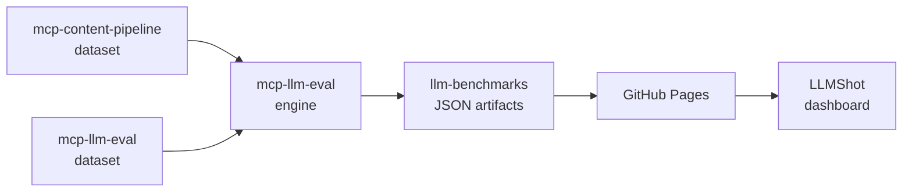

# llm-benchmarks

Benchmark datasets and results evaluating LLMs across providers on quality, latency, and cost.

See [LLMShot](https://llmshot.vercel.app) for the canonical interactive view of the data.



## Domains

### Real-Time Inference

Tests latency-critical, streaming use cases where TTFT and per-query cost matter. Scope: 5 models × 30 questions across 3 meeting types (150 runs total).

### Text Generation

Tests structured output quality on longer-form reasoning and content tasks. Two sub-benchmarks: **Eval Gates** (factual/reasoning/summarization prompts for CI/CD quality gates) and **Content Pipeline** (video analysis and X feed digest). Scope: 5 models × 19 questions × 95 runs total.

## Data sources

Each benchmark's dataset is defined in the repo that consumes the model being tested. The dataset lives with the use case it represents — so the benchmark reflects real production requirements, not synthetic prompts.

- **Real-Time Inference** — meeting transcript analysis questions (ADR, sprint planning, client discovery). Dataset is private (proprietary domain).
- **Eval Gates** — [mcp-llm-eval](https://github.com/berkayildi/mcp-llm-eval)'s own factual/reasoning/summarization dataset, used to dogfood the evaluation engine.
- **Content Pipeline** — [mcp-content-pipeline](https://github.com/berkayildi/mcp-content-pipeline)'s YouTube transcript and X feed digest prompts, taken from the production MCP server's real tool contracts.

This separation — engine in mcp-llm-eval, datasets in the consuming repos — means each team defines their own quality bar for their specific task.

## Structure

```
├── realtime/
│   ├── summary.json       # Aggregate stats per model
│   └── benchmark.json     # Per-question per-model results
└── text-generation/
    ├── eval-gates-summary.json
    ├── eval-gates-benchmark.json
    ├── content-pipeline-summary.json
    └── content-pipeline-benchmark.json
```

## Methodology

- Evaluation engine: [mcp-llm-eval](https://github.com/berkayildi/mcp-llm-eval) v0.4.0+
- `max_output_tokens`: 2048 across all providers
- Gemini 2.5 Flash: thinking disabled (`thinking_budget=0`) for benchmark parity
- Judge model: `gpt-4o-mini`, scoring faithfulness and relevance (0-1)
- Real-Time Inference was run before the Gemini thinking-fix landed in mcp-llm-eval v0.4.0. Flash numbers in that benchmark are affected. Text Generation benchmarks use the fixed version.

## Evaluation tools

- [mcp-llm-eval](https://github.com/berkayildi/mcp-llm-eval) — MCP server + CLI for running evaluations and enforcing quality gates in CI/CD
- [LLMShot](https://github.com/berkayildi/llmshot) — Benchmark visualization dashboard

## License

MIT © Berkay Yildirim
