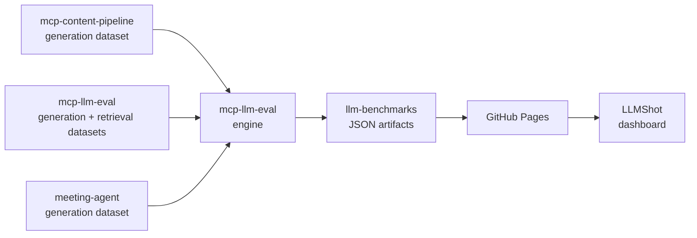

# llm-benchmarks

Benchmark datasets and results evaluating LLMs across providers on quality, latency, and cost.

See [LLMShot](https://llmshot.vercel.app) for the canonical interactive view of the data.



## Domains

### Real-Time Inference

Tests latency-critical, streaming use cases where TTFT and per-query cost matter. Scope: 5 models × 30 questions across 3 meeting types (150 runs total).

### Text Generation

Tests structured output quality on longer-form reasoning and content tasks. Two sub-benchmarks: **Eval Gates** (factual/reasoning/summarization prompts for CI/CD quality gates) and **Content Pipeline** (video analysis and X feed digest). Scope: 5 models × 19 questions × 95 runs total.

### Retrieval & RAG

Tests retrieval quality, citation faithfulness, and end-to-end RAG performance. Two sub-benchmarks:

- **BM25 Baseline** — keyword retrieval over a 60-chunk AWS documentation corpus (S3, CloudFront, Lambda@Edge, Cognito, IAM, ALB, ECS, Fargate). 5 generation models × 20 queries = 100 runs. Establishes a deterministic, model-agnostic baseline.
- **Embeddings Comparison** — 3 embedding adapters (OpenAI text-embedding-3-small, OpenAI text-embedding-3-large, Google gemini-embedding-001) running on the same corpus and queries, with 5 generation models per retriever. 300 runs total. Anthropic isn't in the comparison because they don't ship a public embeddings API.

Headline finding: Google embeddings beat BM25 on recall (+5pts) and nDCG (+4pts) on this AWS corpus. OpenAI embeddings underperform BM25 on this corpus — a non-obvious finding likely driven by AWS docs being keyword-heavy and OpenAI embeddings being general-purpose. BM25 wins retrieval latency by 400-600x (sub-millisecond vs 400-575ms for embedding-based).

## Data sources

Each benchmark's dataset is defined in the repo that consumes the model being tested. The dataset lives with the use case it represents — so the benchmark reflects real production requirements, not synthetic prompts.

- **Real-Time Inference** — meeting transcript analysis questions (ADR, sprint planning, client discovery). Dataset is private (proprietary domain).
- **Eval Gates** — [mcp-llm-eval](https://github.com/berkayildi/mcp-llm-eval)'s own factual/reasoning/summarization dataset, used to dogfood the evaluation engine.
- **Content Pipeline** — [mcp-content-pipeline](https://github.com/berkayildi/mcp-content-pipeline)'s YouTube transcript and X feed digest prompts, taken from the production MCP server's real tool contracts.
- **Retrieval & RAG** — [mcp-llm-eval](https://github.com/berkayildi/mcp-llm-eval)'s own AWS documentation corpus (60 chunks across 8 services). 20 labelled queries with `relevant_chunk_ids` ground truth, mix of single-chunk lookup, multi-chunk synthesis, and cross-service reasoning.

This separation — engine in mcp-llm-eval, datasets in the consuming repos — means each team defines their own quality bar for their specific task.

## Structure

```
├── realtime/
│   ├── summary.json       # Aggregate stats per model
│   └── benchmark.json     # Per-question per-model results
├── text-generation/
│   ├── eval-gates-summary.json
│   ├── eval-gates-benchmark.json
│   ├── content-pipeline-summary.json
│   └── content-pipeline-benchmark.json
└── retrieval/
    ├── eval-gates-rag-summary.json     # BM25 baseline summary
    ├── eval-gates-rag-benchmark.json   # BM25 baseline per-query
    ├── embeddings-summary.json         # Embeddings comparison summary
    └── embeddings-benchmark.json       # Embeddings comparison per-query
```

## Methodology

- Evaluation engine: [mcp-llm-eval](https://github.com/berkayildi/mcp-llm-eval) v0.7.0+
- `max_output_tokens`: 2048 across all providers
- Gemini 2.5 Flash: thinking disabled (`thinking_budget=0`) for benchmark parity
- Judge model: `gpt-4o-mini`, scoring faithfulness and relevance (0-1)
- Retrieval adapter: BM25 (in-memory, via `rank_bm25`), k=5
- RAG quality is scored on two LLM-as-judge axes: `context_relevance` (per-chunk relevance to the query) and `citation_faithfulness` (whether the generated answer is supported by retrieved chunks). Both judges produce 1-5 integer scores, normalised to 0-1 floats internally.
- Retrieval latency is timed per-query and reported as p50 and p95. BM25 in-memory typically lands in single-digit milliseconds.
- Embedding-based retrieval (v0.7.0+): three adapters benchmarked alongside BM25 — OpenAI text-embedding-3-small (1536 dims, $0.02/Mtok), OpenAI text-embedding-3-large (3072 dims, $0.13/Mtok), Google gemini-embedding-001 (3072 dims, $0.15/Mtok). Corpus embeddings cached on disk, deterministic L2-normalized cosine similarity, deterministic tie-breaking.

## Evaluation tools

- [mcp-llm-eval](https://github.com/berkayildi/mcp-llm-eval) — MCP server + CLI for running evaluations and enforcing quality gates in CI/CD
- [LLMShot](https://github.com/berkayildi/llmshot) — Benchmark visualization dashboard

## License

MIT © Berkay Yildirim
